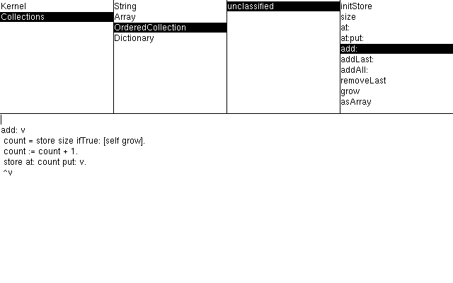

# smallishtalk

[](https://github.com/schani/smallishtalk/actions/workflows/ci.yml)

A complete implementation of [SPEC.md](SPEC.md): the Rust VM (**interpreter
only, no JIT**) *and* the Smalltalk-side compiler with its GNU Smalltalk
bootstrap, through the spec's Phase 5 — the compiler self-hosts on the VM
and its output is bit-identical to the GST cross-compile.

## Usage

**Prerequisites**: a Rust toolchain (edition 2024) and GNU Smalltalk 3.2.5
(`gst`) — `gst` bootstraps images from the portable Smalltalk sources.

**Build and test**

```sh
cargo build --release          # the `smallishtalk` VM binary
make test                      # ALL tests (what CI runs)
```

`make test` = `cargo test` (the Rust/VM suite, the corpus, self-hosting +
the bootstrap fixpoint, and the in-image Smalltalk suite) +
`./run-st-tests.sh` (the compiler's GNU Smalltalk SUnit suites). Tests
whose subject is in-image behavior are themselves written in Smalltalk:
`st/tests/ui/` holds a minimal in-image SUnit (`Harness.st`) plus the
graphics/WM/widget/reflection/browser suites, run on the VM by the
in-image `TestRunner` and launched by `cargo test --test st_suite`.

**Run an image** — the VM loads a STIM image and runs its active process:

```sh
cargo run --release --bin smallishtalk -- <image.im>
```

`SMALLISHTALK_STATS=1` dumps the VM counter table on exit;
`SMALLISHTALK_GATE=1` additionally enables the gated hot-path counters.

**Build an image** — images are cross-compiled from Smalltalk by the in-repo
compiler running under `gst`. The compiler sources must be filed in the order
below (a builder script then writes the image). For a corpus program:

```sh
gst -Q \
  st/compiler/Compat.st st/compiler/Treaty.st st/compiler/Platform.st \
  st/compiler/AST.st st/compiler/Lexer.st st/compiler/Parser.st \
  st/compiler/ChunkReader.st st/compiler/CodeGen.st st/compiler/Encoder.st \
  st/compiler/ImageWriter.st st/compiler/Compiler.st \
  st/tools/build_corpus_image.st -a st/kernel/kernel.st corpus/<program>.st /tmp/out.im
cargo run --release --bin smallishtalk -- /tmp/out.im
```

`cargo test --test corpus_test` automates exactly this for every `corpus/*.st`
(diffing stdout against the checked-in `corpus/*.expected`).

**Regenerate the Treaty mirror** after editing `treaty.json`:

```sh
cargo run --bin gen_treaty_st       # rewrites st/compiler/Treaty.st
```

**Benchmarks**: `make bench` (median-of-5 with a GST-ratio column; history in
`bench/history.csv`). Profile from inside any image with `Profiler spy: [...]`.

### Running the UI (this branch)

This branch adds a bitmap display, an Oberon-style tiling window manager, a
small widget toolkit and a live **Class Browser** (see [UI.md](UI.md)). It is
**headless-first** — the whole UI runs, is driven, and is screenshot-tested with
no window, so it works in CI and can be operated by a person or an agent.



*The five-pane Class Browser rendered by the VM from a running image: category /
class / protocol / selector lists over the retained live source of
`OrderedCollection>>add:`. Text is the baked-in proportional strike font
(Adobe Helvetica 12, from the X11 75dpi BDF collection).*

**Quick start** — one command from a fresh checkout builds the VM,
cross-compiles a UI image and runs it:

```sh
make ui            # headless: renders the Class Browser to ./ui-screenshot.png
make ui-window     # a live, click-navigable window (needs the `ui` feature + a display)
```

(`make ui` needs a Rust toolchain and `gst`; it opens no window, so it works
over SSH and in CI. `scripts/run-ui.sh [--window]` is the underlying script.)

Under the hood, a UI image bundles the kernel, the compiler (for live compilation) and the UI
layers, plus a driver program of ordinary Smalltalk. Build one and run it:

```sh
gst -Q \
  st/compiler/Compat.st st/compiler/Treaty.st st/compiler/Platform.st \
  st/compiler/AST.st st/compiler/Lexer.st st/compiler/Parser.st \
  st/compiler/ChunkReader.st st/compiler/CodeGen.st st/compiler/Encoder.st \
  st/compiler/ImageWriter.st st/compiler/Compiler.st \
  st/tools/build_ui_image.st -a <driver.st> /tmp/ui.im
cargo run --release --bin smallishtalk -- /tmp/ui.im
```

An example driver — open a Class Browser, navigate it, and save a PNG
screenshot (the exact loop the demo image uses):

```smalltalk
| b f |
b := ClassBrowser bounds: (Rectangle origin: (Point x: 0 y: 0) corner: (Point x: 480 y: 300)).
b selectCategoryNamed: 'Kernel'.
b selectClassNamed: 'OrderedCollection'.
f := Form width: 480 height: 300.
b displayOn: (Canvas on: f).
f saveTo: '/tmp/browser.png'.
```

Editing a method's source in the browser and calling `accept` recompiles and
installs it **live**; `Smalltalk evaluate: '3 + 4'` is a do-it.

- Regenerate the baked-in font: `python3 st/tools/gen_font_bdf.py st/ui/gfx/helvR12.bdf > st/ui/gfx/DefaultFont.st`.
- Optional real window (first external dep, `minifb`): `cargo run --features ui -- --ui /tmp/ui.im`.
- Headless UI tests: `cargo test --test ui_headless --test st_suite` — the
  host seam is tested in Rust; everything above it (graphics, WM, widgets,
  reflection, browser) is in-image Smalltalk tests in `st/tests/ui/`.

## The two codebases

**The VM (Rust, `src/`)** and **the compiler (portable Smalltalk, `st/`)**
share one binary contract: `treaty.json`, mirrored as `src/treaty.rs` and
the generated `st/compiler/Treaty.st` (`cargo run --bin gen_treaty_st`),
with tests holding all three together.

## Bootstrap pipeline

1. **Phase 2** — the compiler (lexer, parser, chunk reader, codegen with
   capture analysis and control-flow macros, encoder, STIM heap writer)
   runs under GNU Smalltalk 3.2.5 with SUnit suites
   (`./run-st-tests.sh`).
2. **Phase 3** — the handshake: `corpus/*.st` programs are cross-compiled
   to images and executed by the VM; stdout is diffed against
   `corpus/*.expected` (`cargo test --test corpus_test`).
3. **Phase 4** — the kernel (`st/kernel/kernel.st`) grows corpus-first:
   collections, streams, closures/NLR, the full in-image exception system
   over the §11 primitives, processes/semaphores/Delay/terminate. The
   corpus also runs under GC stress (64 KB young space) and through
   snapshot/reload round-trips at an arbitrary send boundary.
4. **Phase 5** — self-hosting (`cargo test --release --test phase5_test`):
   a self-host image contains the kernel plus the compiler's own source
   (compiled by our own codegen). Running it, the in-image compiler
   compiles the entire corpus and the kernel **bit-identically** to GST's
   output — and compiles *itself* bit-identically, with the resulting
   third-generation image running correctly. `tests/bootstrap_test.rs`
   closes the loop as a fixpoint: S0 (the compiler compiled by GST), S1
   (compiled by S0) and S2 (compiled by S1) are asserted **bit-identical**,
   using a self-replicating driver so every generation builds from exactly
   the same bytes.

The portable-dialect divergences between GST and the self-hosted kernel
are confined to `st/compiler/Compat.st` (GST side: `charAt:`, `byteAt:`,
`byteAt:put:`, `Platform bytesOf:`) and documented conventions
(`String at:` answers bytes per §15; Symbol equality is identity, so
`asString` copies; `Array =` is elementwise; class-side `super` sites
bind the metaclass).

**Unicode**: source is UTF-8. The compiler's lexer and chunk reader scan
integer bytes (never host Characters — GST's `Character` vs
`UnicodeCharacter` split and its equality semantics differ from ours), so
string literals, quoted symbols and comments preserve their bytes
verbatim on both hosts; `String size` is a byte count. A `$`-literal
decodes exactly one UTF-8 scalar (full validation: overlongs,
surrogates, range, truncation) and travels through the compiler as an
`StCharCode` integer; the target kernel's `Character` holds any scalar.
The compiler's *own* sources keep `$`-literals ASCII (GST's native
file-in requires it; `tests/portability_guard_test.rs` enforces it).

## What's here

| Module | Spec | Contents |
|---|---|---|
| `treaty.json` / `src/treaty.rs` | App. A | The binary contract as executable data; a test asserts the two agree in both directions |
| `src/value.rs` | §1 | 63-bit SmallInteger / pointer tagging |
| `src/heap.rs` | §2–3, §14 | Headers, three formats, overflow size word, young semispaces + old space, linear heap walking |
| `src/asm.rs` | §6 | Assembler/disassembler for the 32-bit register bytecode (test tool / debugging tool) |
| `src/vm.rs` | §4–5, §7 | Bare bootstrap (nil/true/false, Treaty classes, specials), lookup, write barrier, method install, processes |
| `src/interp.rs` | §6–8, §12–13 | The register interpreter: overlapping frames, stack growth, sends with inline + global caches, specialized sends, closures, NLR, the re-entrant unwinder, safepoints |
| `src/prims.rs` | §16 | The numbered primitive table (object essentials, SmallInteger/Float, blocks, exceptions, processes/semaphores, files/stdio/clocks, system) |
| `src/gc.rs` | §14 | Copying scavenger with age-based tenuring + SSB, and Lisp-2 sliding mark-compact for old space |
| `src/image.rs` | §17 | STIM snapshot write / load with one-pass pointer relocation |
| `src/fixture.rs` | §20 | The heap-builder fixture (`MethodBuilder`) for hand-assembled-bytecode tests |
| `src/counters.rs` | plan §3 | Exact VM counters: always-on slow-path tier + gated hot-path tier (`SMALLISHTALK_STATS=1`, `SMALLISHTALK_GATE=1`) |
| `src/profile.rs` | plan §2 | The sampling profiler: timer thread → safepoint samples, GC/prim pseudo-frames, epoch-keyed symbolization; driven from Smalltalk via `Profiler spy: [...]` (prims 420–426) |

`cargo test` runs the whole Phase-1-style suite: per-opcode
interpreter tests, GC unit + stress tests, closure/NLR batteries, an
exception battery driven by a hand-assembled in-image exception kernel,
process/scheduler tests, and snapshot round-trips that resume mid-method.

The binary runs an image: `smallishtalk <image.im>`.

**Profiling & benchmarks**: `make bench` runs the workload suite (median-of-5
with a GST ratio column, history in `bench/history.csv`); `Profiler spy:
[...]` profiles from inside any image. See `docs/profiling.md` and
`docs/profiling-plan.md`.

## Documented v1 concretizations / deviations

Decisions the spec leaves open (or that this implementation makes
differently, noted here and in code comments):

- **Stack scanning.** Instead of pinning the running stack, the interpreter
  re-derives its cached registers after every collection (the Invariant's
  sanctioned alternative). Stacks maintain the invariant that *every* word
  is a valid tagged value (temps nil-filled on push, frames nil-filled on
  pop), so the GC scans whole stack objects with no live-extent computation.
- **Frame slots.** The method header's `frameSlots` counts bytecode-visible
  slots (receiver + args + temps + scratch); the frame footprint is
  `4 + frameSlots`. A send staged at bytecode slot `r` puts the callee's
  four control words in caller slots `r-4..r-1`, so `r ≥ 4` and anything
  live across the send must sit below `r-4`.
- **Specialized-send slow paths** stage receiver+args in the free area
  above the current frame and dispatch through the ordinary send machinery
  using the Treaty `specializedSelectors` array (the ABC encodings carry no
  send-site index).
- **Exception helpers.** Three small extra primitives (222–224:
  `handlerInfoAt:`, `setHandlerState:to:`, `signalContext`) let the
  in-image `signal` loop read handler frames without bit-twiddling method
  headers in bytecode. `primFindHandler` applies the plain is-kind-of test
  VM-side for v1 (the image-side `handles:` loop can take over later).
- **Ensure interception.** Pending unwind state (target, serial, value)
  lives in the ensure frame's reserved slots; the unwinder activates the
  ensure block with a continuation-marker frame flag (`FLAG_UNWINDCONT`).
  Fully re-entrant; an NLR out of an ensure block abandons the pending
  unwind naturally.
- **Termination.** `terminate` on self unwinds to the base frame (running
  ensures) and marks the process terminated; on another process it pushes
  the Treaty terminate trampoline onto *that* process's stack — the
  trampoline is a method whose primitive is `terminate` with the process as
  receiver, so the target performs the same self-termination in its own
  context.
- **Old-space walking.** A storage word with zero class bits is an overflow
  size word (real headers always have a nonzero classIndex); this makes the
  heap linearly walkable with no side tables.
- **StackOverflow** beyond the image limit is a Rust-level error for now
  (the in-image signal arrives with the image kernel).
- **MethodDictionary** is Treaty-fixed as parallel keys/values Arrays with
  linear identity scan (behind the global lookup cache).
